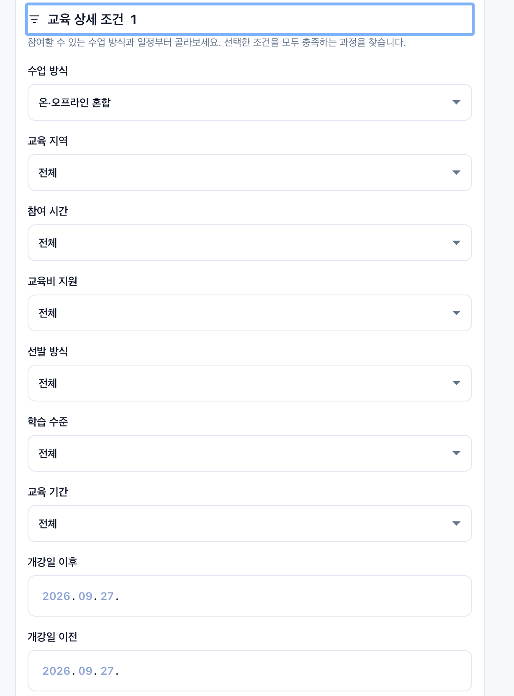
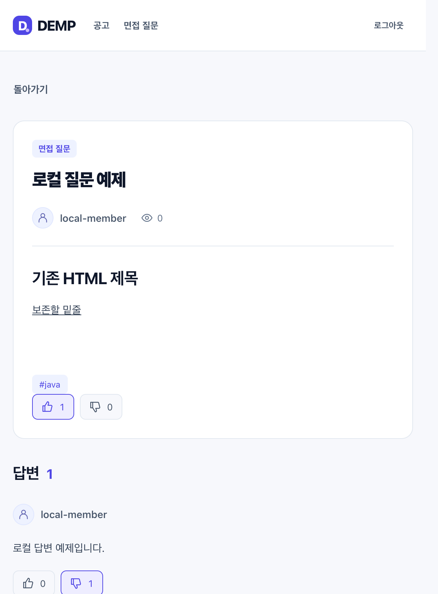
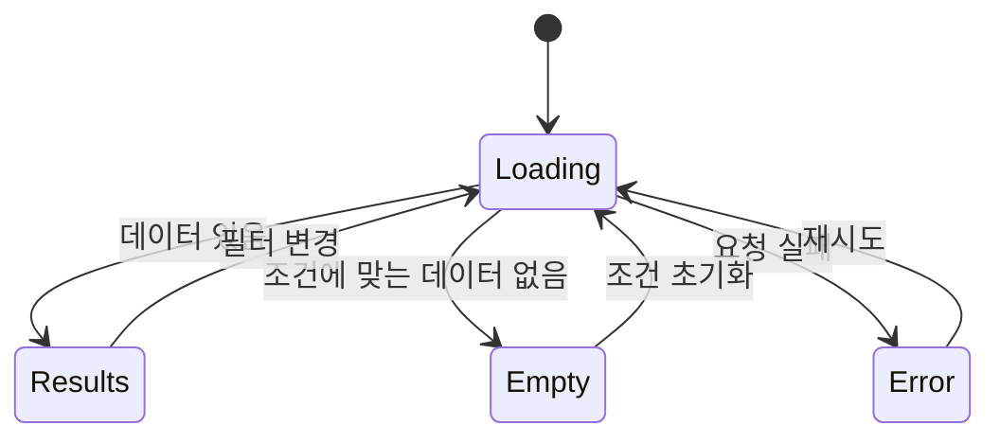
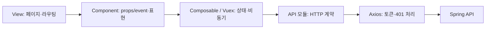

# DEMP · Frontend

**개발자 채용·교육 공고 탐색과 질문·답변 커뮤니티의 Vue 3 + TypeScript 클라이언트.**

사용자가 채용 조건과 교육 과정을 비교하고, 원본 공고로 이동해 지원하도록 돕습니다. 운영자는 관리자 화면에서 출처·조건·게시 상태를 관리합니다. 앱 이름은 **DEMP**입니다.

[백엔드·전체 설계](https://github.com/seungmin-park/demp) · [성능 개선 보고서](https://github.com/seungmin-park/demp/blob/main/docs/verification/measured-query-performance/README.md) · [전체 작업 기록](https://github.com/seungmin-park/demp/blob/main/tasks.md) · [운영·호환성](docs/operations.md)

## 현재 화면





화면은 로컬 예제 데이터로 촬영했습니다.

## 구현한 사용자 흐름

| 화면 | 사용자가 할 수 있는 일 |
|---|---|
| 채용 | 신입·경력·무관 구분, 기술·직무 필터, 공고 상세 확인, 원본 지원 페이지 이동 |
| 교육 | 교육 방식·지역·기간·비용·지원 조건 등 필터, 기수·지원금·마감 확인 |
| 질문·답변 | 태그 탐색·정렬, Markdown 작성·미리보기, 추천·비추천·취소 |
| 관리자 | 초안 작성·공개·마감/비공개, 출처·원문 확인일·변경 이력, 오류 제보 처리, 질문·답변 수정·삭제 |
| 로그인 | 인증 상태 복원, 보호 경로 이동, 세션 만료 시 로그인 후 돌아갈 경로 보존 |

지원하기는 외부 원문 또는 별도 지원 URL로 이동합니다. 이미지는 선택 업로드이며 기본 이미지로도 등록할 수 있습니다. 외부 URL에서 이미지를 자동 수집하거나 원문을 대량 복제하는 기능은 없습니다.

## UI에서 중요하게 다룬 부분

### 데이터 요청 상태를 화면 의미와 맞추기



채용·부트캠프의 빈 결과 안내를 구분하고, 처음부터 없는 목록과 필터 결과 없음, 서버 오류를 같은 문구로 보여주지 않습니다. 필터가 바뀌면 이전 응답은 버리고 새 조건의 첫 페이지부터 시작합니다.

### 무한 스크롤과 비동기 경쟁

- 목록 끝에서 다음 페이지를 읽고, 진행 중·마지막 페이지·오류 상태에서는 자동 요청을 반복하지 않습니다.
- 겹치는 ID는 한 번만 표시합니다. 자동 감지 외에 더보기·재시도도 제공합니다.
- 반응 저장은 응답이 확정될 때까지 연타를 막습니다. 실패하면 기존 값을 보존하고, 화면 이동 후 도착한 응답은 반영하지 않습니다.
- 부모의 같은 글 데이터 갱신이 저장 중 상태를 풀던 문제를 회귀 테스트로 재현해 수정했습니다.

### 작성기와 안전한 본문 표시

질문·답변은 공통 Markdown 작성기와 미리보기를 사용합니다. 기존 HTML 편집은 `markdownFromHtml`, 변환은 `renderMarkdown`을 사용합니다. 공고는 Tiptap 본문 작성기에서 표·이미지·붙여넣기를 지원합니다. API에는 정화한 HTML을 저장하고, 출력은 `SafeHtml`의 DOMPurify 허용목록을 통과합니다. Bootstrap/jQuery/Summernote CDN 의존성은 제거했습니다.

기술 배열은 `Java, Spring`, 날짜는 `2026.09.27 09:00`처럼 표시합니다. API 저장 형식을 화면 표시 때문에 바꾸지 않습니다.

## 구조와 타입 경계



제품 코드는 `src/**/*.ts`와 Vue SFC의 `<script lang="ts">`로 전환했습니다. `strict` 타입 검사는 DTO·nullable 값·이벤트·템플릿까지 적용합니다. Vue 컴포넌트는 표현·상태·API 경계로 검토하고, 독립 TypeScript 모듈은 책임과 작은 계약을 중심으로 나눴습니다.

- `src/types/api.ts`: Slice·회원·공고·질문·답변·반응 계약.
- `src/api/client.ts`: 요청 직전 `X-AUTH-TOKEN` 부착, 401 시 로그인 상태 정리.
- 인증 저장은 기존 `vuex` localStorage 형식을 유지하며 손상된 JSON을 로그아웃 상태로 처리합니다.
- 테스트·도구 설정 일부는 JavaScript입니다. 제품 strict 검사를 `any`나 `@ts-ignore`로 우회하지 않습니다.

## 실행

필요 조건: asdf Node 플러그인, Node **24.21.0**. 먼저 [백엔드 README](https://github.com/seungmin-park/demp#로컬-실행)에 따라 local 서버를 18080 포트로 실행합니다.

```sh
asdf install nodejs
node --version
npm ci
DEV_API_TARGET=http://127.0.0.1:18080 npm run dev
```

화면은 `http://localhost:5050`, 로컬 일반 회원은 **local-member / password**입니다. 관리자 화면은 서버가 `ROLE_ADMIN`을 부여한 계정으로 접근합니다. 일반 회원가입은 관리자 권한을 부여하지 않습니다. [관리자 계정 준비](https://github.com/seungmin-park/demp/blob/main/docs/verification/admin-console/account-setup.md)를 참고합니다.

| 도구 | 고정 버전 |
|---|---|
| Vue / Router / Vuex | 3.5.43 / 5.3.1 / 4.1.0 |
| TypeScript / vue-tsc | 6.0.3 / 3.3.11 |
| Vite / Vitest | 8.3.1 / 5.0.2 |
| Playwright | 1.63.0 |

버전표는 저장소의 재현 환경입니다. TypeScript는 lint parser와의 공통 지원 범위를 기준으로 선택했고, 고정 LTS 채널이 없는 Vue는 업그레이드 당시 안정판을 사용했습니다.

### API 주소

기본 `/api` 요청은 Vite가 `http://localhost:8080`으로 proxy합니다. 위 예제는 `DEV_API_TARGET`으로 18080을 지정합니다. 배포 시 같은 출처 `/api` reverse proxy를 권장하며, 직접 호출이 필요하면 빌드 시 `VITE_API_BASE_URL`과 백엔드 CORS 허용목록을 맞춥니다.

`npm start`의 Express 서버는 `dist`와 SPA 경로만 제공합니다. **API proxy는 제공하지 않으므로** 배포 환경에서 별도로 구성해야 합니다. 환경변수는 `.env.example`, 상세 내용은 [운영 문서](docs/operations.md)를 확인합니다.

## 검증

```sh
npm test
npm run typecheck
npm run lint -- --no-fix
npm run build
npx playwright install chromium
npm run test:e2e -- --headed
```

최종 확인: **단위·컴포넌트 156개, 타입 검사·lint·build 통과, headed Playwright 20개 통과**. 기능 변경 검증 기록은 [반응 기능 보고서](https://github.com/seungmin-park/demp/blob/main/docs/verification/persistent-content-reactions/t99-t101.md)에 있습니다.

| 검증 | 범위와 한계 |
|---|---|
| Vitest | 렌더링·입력·emits·store 상태·비동기 실패/응답 역전 |
| vue-tsc / ESLint / Vite build | 제품 타입·코드 규칙·배포 산출물 생성 |
| Playwright | API fixture를 사용한 브라우저 사용자 흐름. 실제 DB/S3 검증 아님 |
| cmux 실제 브라우저 | 로컬 Spring/H2에 로그인·게시·필터·스크롤·반응 저장/재조회 |

로컬 E2E는 현재 cmux 보조 pane에서 러너와 브라우저 과정을 볼 수 있게 진행합니다. CI는 headless입니다. 성공한 화면만 찍은 스크린샷을 자동 E2E 통과 근거로 대체하지 않습니다.

## 성능 개선과 공개 범위

프런트는 전체 질문 배열을 한 번에 받던 흐름에서 페이지 단위 응답으로 바뀌었고, 무한 스크롤은 필요한 페이지를 순서대로 읽습니다. **서버 측 대용량 측정 수치를 브라우저 렌더링 속도나 Lighthouse 점수로 부르지 않습니다.** 원시 표본·SQL 수·실패 사례와 환경 제약은 [백엔드 성능 보고서](https://github.com/seungmin-park/demp/blob/main/docs/verification/measured-query-performance/README.md)를 참고합니다.

공개 운영 배포·실사용 트래픽 측정은 수행하지 않았습니다. 운영 반영 전 실제 MySQL·파일 저장·동시 사용자 부하 확인이 필요합니다. 초기 화면과 과거 테스트 건수는 `docs/`의 날짜별 기록에 보존하며, 이 문서는 현재 구현을 설명합니다.
