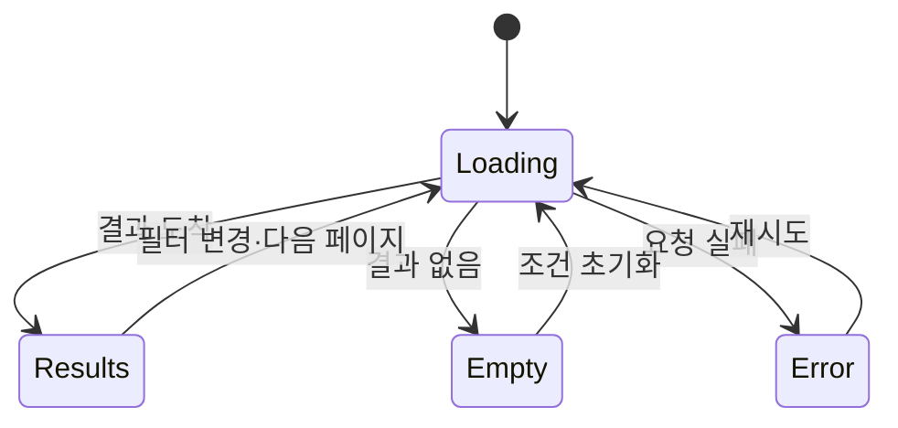
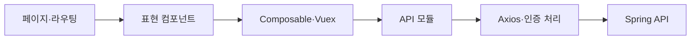

# DEMP Frontend

### 조건을 비교하고, 원문으로 이동하고, 배운 것을 묻는 화면

DEMP의 Vue 3·TypeScript 클라이언트입니다. 채용 공고와 교육 과정의 조건을 좁혀 살펴보고, **지원하기**에서 원본 페이지로 이동합니다. 질문·답변에서는 Markdown으로 글을 쓰고 회원별 추천·비추천을 남깁니다. 공고를 관리하는 운영 화면도 같은 앱에 있습니다.

[서비스 전체 소개](https://github.com/seungmin-park/demp) · [화면 보기](#화면과-사용-흐름) · [UI 설계](#ui에서-해결한-문제) · [실행](#로컬-실행) · [검증](#검증)

## 화면과 사용 흐름

| 영역 | 주요 행동 | 결과가 없거나 실패하면 |
| --- | --- | --- |
| 채용 | 신입·경력·무관, 직무·기술 조건으로 탐색하고 원본 지원 페이지로 이동 | 처음부터 공고가 없는 경우와 필터 결과가 없는 경우를 구분 |
| 교육 | 방식·지역·기간·비용·지원 대상 등으로 좁히고 기수·마감 확인 | 조건에 맞는 교육 과정이 없음을 설명하고 필터 초기화 제공 |
| 질문·답변 | 태그 검색·정렬, Markdown 작성·미리보기, 추천·비추천·취소 | 저장 실패 시 확정된 반응 수를 유지하고 재시도 안내 |
| 관리자 | 공고 초안 작성, 검토 후 공개, 마감·비공개, 출처·변경 이력·제보 관리 | 서버 권한이 없는 사용자는 운영 화면에서 차단 |

<p align="center">
  
  
</p>

화면은 로컬 예제 데이터로 촬영했습니다. 기술 배열은 `Java, Spring`, 날짜는 `2026.09.27 09:00`처럼 읽기 쉬운 형태로 표시합니다. API의 저장 형식은 화면 표시 때문에 바꾸지 않습니다.

## UI에서 해결한 문제

### 필터와 무한 스크롤의 응답 순서

사용자가 필터를 바꾸는 동안 이전 페이지 요청이 늦게 도착하면, 새 검색 결과를 덮어쓸 수 있습니다. 목록은 **현재 조건과 페이지**를 한 흐름으로 관리하고, 조건이 바뀌면 첫 페이지부터 다시 읽으며 이전 응답을 버립니다.



스크롤 끝에서 다음 페이지를 한 번만 요청하고, 마지막 페이지나 실패 상태에서는 자동 요청을 반복하지 않습니다. 겹치는 ID도 한 번만 표시합니다. 자동 감지 외에 **더보기·재시도**를 제공해 사용자가 이어서 탐색할 수 있습니다. [스크롤·필터 E2E 사례](tests/e2e/community.spec.js)

### 저장 중인 반응과 확정된 반응

버튼을 눌렀다는 사실과 서버가 저장했다는 사실은 다릅니다. `useContentReaction`은 저장 중 연타를 막고 실패하면 직전 확정값을 유지합니다. 다른 글로 이동한 뒤 늦게 도착한 응답도 현재 화면에 반영하지 않습니다. 새로고침 뒤에는 서버가 반환한 회원별 선택과 집계로 화면을 다시 그립니다. [반응 저장 검증](https://github.com/seungmin-park/demp/blob/main/docs/verification/persistent-content-reactions/t99-t101.md)

### 작성기와 본문 표시

질문·답변은 공통 Markdown 작성기와 미리보기를 사용합니다. 기존 HTML을 다시 편집할 때는 Markdown으로 변환합니다. 공고는 Tiptap 작성기에서 표·이미지·붙여넣기를 지원합니다. 저장 전 서버가 본문을 정화하고, 화면 출력은 `SafeHtml`의 DOMPurify 허용목록을 거칩니다. Bootstrap·jQuery·Summernote CDN 의존성은 제거했습니다.

이미지는 선택 업로드입니다. 외부 공고의 이미지를 자동 수집하거나 원문 전체를 대량 복제하지 않습니다. **지원하기**는 원본 또는 별도 지원 URL을 엽니다. [게시 정책](https://github.com/seungmin-park/demp/blob/main/docs/plans/curated-publication-policy.md)

## 구조와 상태 경계



표현 컴포넌트는 props와 이벤트에 집중합니다. 비동기 요청·응답 경쟁·실패 상태는 composable이 관리하고, API 모듈은 HTTP 계약을 맡습니다. Vuex는 로그인 상태를 소유합니다. 모든 제품 `src/**/*.ts`와 Vue SFC의 `<script lang="ts">`에 strict 타입 검사를 적용하며 DTO·nullable 값·이벤트·템플릿까지 검사합니다.

| 위치 | 책임 |
| --- | --- |
| `src/types/api.ts` | Slice·회원·공고·질문·답변·반응 응답 계약 |
| `src/api/client.ts` | 요청 직전 인증 토큰 부착, 401 응답 시 로그인 상태 정리 |
| `src/api/reactions.ts` | 질문·답변 반응 HTTP 요청 |
| `src/composables/useContentReaction.ts` | 반응 저장 중 상태·실패·응답 순서 제어 |

설정·테스트 도구의 일부 파일은 JavaScript입니다. [프런트 기능 지도](docs/engineering/feature-map.md) · [백엔드의 저장 책임](https://github.com/seungmin-park/demp/blob/main/docs/engineering/architecture.md)

## 기술 스택

| 영역 | 저장소 고정 버전 |
| --- | --- |
| 런타임·화면 | Node 24.21.0, Vue 3.5.43, Router 5.3.1, Vuex 4.1.0 |
| 언어·빌드 | TypeScript 6.0.3, vue-tsc 3.3.11, Vite 8.3.1 |
| 작성·검증 | Tiptap Vue 3.31.3, Vitest 5.0.2, Playwright 1.63.0 |

버전은 `package.json`·lockfile·`.tool-versions` 기준입니다. [버전별 공식 문서](docs/engineering/official-docs.md) · [업그레이드 호환성 기록](https://github.com/seungmin-park/demp/blob/main/docs/verification/runtime-framework-and-typescript-upgrade/README.md)

## 로컬 실행

asdf Node 플러그인과 Node 24.21.0이 필요합니다. 먼저 [백엔드 로컬 실행](https://github.com/seungmin-park/demp#로컬-실행)에 따라 Spring 서버를 18080 포트로 시작합니다. 아래 명령은 **이 저장소의 루트**에서 실행합니다.

```sh
asdf install nodejs
npm ci
DEV_API_TARGET=http://127.0.0.1:18080 npm run dev
```

`http://localhost:5050`에 접속합니다. local 예제 회원은 `local-member / password`입니다. 관리자 기능은 서버가 `ROLE_ADMIN`을 부여한 별도 계정으로 확인합니다. [계정 준비 방법](https://github.com/seungmin-park/demp/blob/main/docs/verification/admin-console/account-setup.md)

개발 서버의 `/api` 요청은 `DEV_API_TARGET`으로 proxy합니다. `npm start`는 빌드된 SPA 파일을 제공하며 API proxy는 제공하지 않습니다. 배포 시 같은 출처의 `/api` reverse proxy 또는 빌드 시 API 주소·서버 CORS 설정이 필요합니다. [환경변수와 배포 구성](docs/operations.md)

## 검증

```sh
npm ci
npx playwright install chromium
npm run verify -- --headed
```

2026-09-29 기록에서 단위·컴포넌트 **156개**, headed Playwright **20개**가 통과했고 타입·lint·build도 성공했습니다. Playwright는 API fixture를 쓰는 화면 흐름 검증입니다. 실제 Spring/H2와 연결한 cmux 브라우저에서는 반응 저장·전환·취소 후 재조회까지 별도로 확인했습니다. [실행 명령·결과·화면 증거](https://github.com/seungmin-park/demp/blob/main/docs/verification/agent-verification-and-official-docs/README.md)

현재 전체 검증은 AST 책임 경계, Vue·TS 타입, 전체 단위 테스트, lint, build와 새 production preview의 E2E를 연결합니다. 필수 계약 누락·skip·실패와 소스/빌드 변경을 거절하고 `.verification/`에 결과를 남깁니다. 로컬은 사용자가 지정한 현재 세션에서 headed로, CI는 headless로 실행합니다. main은 `DEMP frontend verify`를 요구하며 승인된 PR 작업에서 native 자동 squash 머지를 사용합니다. [CI 운영·공식 조사 근거](docs/engineering/ci-and-delivery.md)

운영 배포와 실사용 트래픽 측정은 아직 수행하지 않았습니다. 서버 측 H2 성능 수치를 브라우저 렌더링 속도로 해석하지 않습니다. [측정 원본과 제약](https://github.com/seungmin-park/demp/blob/main/docs/verification/measured-query-performance/README.md) · [검증 스킬](.agents/skills/verify-dempfrontend/SKILL.md)
