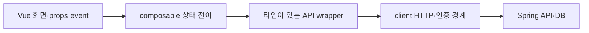
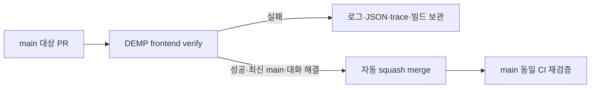

# Vue·TypeScript 검증과 보호된 PR 전달

## 책임과 실행 경로



Vue 컴포넌트는 props/event와 렌더링 책임으로 검토한다. TS 모듈은 공개 계약·변경 이유·의존성 방향으로 검토하며, Vue 컴포넌트에 클래스 SOLID 점수를 매기지 않는다. `useContentReaction`은 저장 중 차단·확정값·늦은 응답 폐기를 소유한다. API가 실패하면 화면이 이전 확정값을 유지해야 한다.

`source-boundaries.mjs`는 Vue의 일반 script/script setup/script src와 TS/JS AST를 읽는다. named/namespace/별칭 import, re-export, 문자열 경로 dynamic import/require를 검사한다. 반응 API의 실행 import는 정확히 `src/composables/useContentReaction.ts`에서만 허용한다. 타입 전용 import는 실행 경로가 아니므로 허용한다. 컴포넌트·뷰는 axios/API client를 직접 가져오지 않으며, composable은 화면을, API는 화면/composable을 역참조하지 않는다. 일반 API wrapper 이용과 기존 client의 store/router 인증 협력은 유지한다.

주석·문자열을 import로 오인하지 않는다. 계산한 import 경로, reflection, 다른 wrapper를 통한 우회, 모든 상태 소유권을 증명하지 않으므로 코드 리뷰와 실제 상태·화면 테스트도 필요하다.

## 하나의 검증 명령

```sh
asdf exec npm ci
asdf exec npx playwright install chromium
asdf exec npm run verify -- --headed
# CI는 npm run verify
```

`verify.mjs`는 경계(probe 포함) → vue-tsc → 전체 Vitest → lint(수정 금지) → build → 새 개발/배포 서버의 Playwright → 결과 계약을 순서대로 실행한다. 실패하면 중단하고 `.verification/summary.json`에 실패 단계와 종료 코드를 남긴다. 각 단계의 로그와 unit/e2e JSON도 같은 폴더에 저장한다. 실행 전에 해당 보고서 폴더를 비워 이전 결과를 재사용하지 않는다.

Playwright가 자신이 시작한 새 production preview와 Vite 개발 서버를 사용한다. verifier는 서로 다른 빈 loopback 포트를 골라 `DEMP_E2E_PORT`와 `DEMP_DEV_E2E_PORT`를 넘긴다. 직접 실행할 때도 서로 다른 숫자 1~65535로 지정한다. 포트 충돌은 기존 서버를 쓰거나 다른 포트로 조용히 이동하지 않고 실패한다. `production`과 `development`가 같은 사용자 흐름을 각각 실행한다. fixture route와 원문 이동 assertion은 각 프로젝트 baseURL에 연결하며 원래 UI 검증을 유지한다. 자동 재시도는 0이다.

타입 검사는 `strict`, `noUncheckedIndexedAccess`, `exactOptionalPropertyTypes`, `noImplicitReturns`, `noFallthroughCasesInSwitch`, 소스 JS의 `checkJs`, Vue `strictTemplates`를 사용한다. 선언된 props/event와 컴포넌트 이름을 검사하고 네이티브 root의 합법적인 속성과 `data-*`는 허용한다. 일반 `npm run build`도 `prebuild`에서 vue-tsc를 반드시 실행한다. `tests/types`의 부정 계약은 금지 코드가 거절되지 않으면 `@ts-expect-error`가 미사용 오류를 내도록 구성했다. 해당 fallthrough 부정 사례에만 린트 예외를 표시하며 애플리케이션에는 적용하지 않는다.

암묵적 any는 strict 타입 검사가 거절한다. 앱 TS/Vue의 명시적 any·ts-ignore·ts-nocheck·ts-expect-error는 lint가 오류로 거절하며 실제 lintText 부정 계약도 필수 assertion이다. 컴파일 부정 사례의 ts-expect-error는 tests/types에만 사용한다. 검증한 라이브러리/DOM의 좁은 타입 보완을 모든 데이터에 대한 강제 캐스팅으로 확대하지 않는다.

`tests/setup.js`는 컴포넌트 warnHandler 및 reactivity가 console에 보내는 `[Vue warn]`을 수집하고 테스트 종료 때 실패시킨다. console 경고는 원래 출력도 유지한다. `tests/e2e/fixtures.js`는 모든 페이지·새 탭의 Vue console 경고를 수집하고 빈 배열을 assertion 및 `vue-warnings` JSON attachment로 남긴다. 결과 검사기는 모든 브라우저 테스트에서 해당 증거가 정확히 하나 있고 비어 있는지 확인한다. fixture를 사용하지 않은 테스트도 성공으로 전달하지 않는다. 잘못된 prop, 미등록 컴포넌트, 누락된 router, 불완전한 API 예제는 원인을 고친다. 의도적인 경고 검증 테스트만 자체 수집기를 지정하며 일반 경고 허용 목록은 두지 않는다.

Vue 경고는 주로 개발 모드에서 발생하므로 production 통과만으로 경고가 없다고 판단하지 않는다. 컴파일러는 네트워크 데이터의 실제 형태·서버 저장·모든 화면 경로를 증명하지 않는다. 경고 검사는 실행한 테스트/사용자 흐름에서 발생한 경고를 증명한다.

`required-verification.json`은 기존 필수 단위 파일, 반응 상태 핵심 assertion, 브라우저 흐름의 이름, 두 브라우저 프로젝트와 Vue 경고 증거를 기록한다. 필수 흐름은 각 프로젝트에 모두 있어야 하며 삭제/skip/빈 실행/실패/flaky/집계 불일치는 실패다. 새 테스트는 추가할 수 있으며 총개수 자체를 고정하지 않는다. 계약 이름 변경·삭제는 manifest와 이유를 함께 리뷰한다. 보고서 내용을 검사하며 테스트의 의미나 요구사항 완전성을 자동으로 판단하지 않는다.

`verify-results.mjs`는 dist HTML의 JS/CSS 참조·존재, 개발 진입점·경로 이탈, 알려진 `fixture-token` 혼입을 확인하고 파일 digest를 기록한다. 범용 비밀 탐지기는 아니다. 실행 전후 source/build digest가 다르면 성공을 거절한다. preview는 검증용이고 운영 웹 서버가 아니다.

## 브라우저 검증 범위

기존 Playwright는 API fixture를 사용하는 development/production 화면·입력·이동·권한 오류·재조회 계약이다. 실제 Spring DB 영속성과 구분한다. 실제 저장 검증은 별도 backend worktree/버전, 격리 H2, preview의 `DEV_API_TARGET`, 브라우저 origin과 Spring CORS 설정을 확인한 뒤 로그인 → 질문/답변 반응 → 전환/취소 → 새로고침 → 별도 HTTP 조회를 수행한다.

로컬에서는 사용자가 지정한 현재 세션에서 headed 러너와 실제 브라우저 과정을 보여준다. 현재 Codex 세션을 지정했다면 cmux를 요구하지 않는다. 자신이 만든 서버만 종료하며 사용자 서버·미커밋 변경은 보존한다.

## CI와 PR



Actions는 검증한 전체 commit SHA로 고정한다. CI는 `contents: read`, checkout credential 미보관, 15분 제한, 동일 PR/branch의 이전 실행 취소를 사용한다. PR와 main push에 경로 필터를 두지 않는다. 증거는 성공/실패 모두 7일 보관한다. 의존성 설치 전 실패하면 일부 보고서가 없을 수 있으므로 GitHub job 로그도 확인한다.

사용자가 PR·머지를 요청한 작업은 전체 검증과 책임 리뷰 후 기존 서명 설정으로 commit/push하고, 같은 head의 열린 PR을 재사용하거나 main PR을 만든다. 사용자 작업과 분리한 파일만 commit하고 PR을 Codex 작업에 첨부한다. 새 무인 봇·예약 작업은 만들지 않는다.

main 보호: PR 필수, GitHub Actions(app 15368)의 정확한 `DEMP frontend verify` 필수, 최신 main 필수, 관리자도 적용, 강제 push·삭제 금지, 대화 해결 필수. 개인 저장소의 승인 인원은 0명이며 승인 리뷰와 자동 검사는 별개다. 저장소의 native auto-merge와 squash를 활성화하고 `gh pr merge <번호> --auto --squash --match-head-commit <전체 SHA>`로 해당 PR에 적용한다. `--admin`이나 main 직접 push로 보호를 우회하지 않는다. 머지 상태·merge SHA·그 main CI를 실제 확인한 뒤 완료한다. 설정은 저장소 외부 상태이므로 다음 전달 때 다시 조회한다.

## 공식 조사 근거

- [Vue TypeScript](https://vuejs.org/guide/typescript/overview): Vite 변환은 타입 검사가 아니며 SFC 검사는 vue-tsc로 수행한다.
- [Vue 테스트](https://vuejs.org/guide/scaling-up/testing.html): 함수/composable, 컴포넌트, 사용자 화면 검증의 목적이 다르며 E2E는 production build를 대상으로 한다.
- [Vue SFC compiler](https://github.com/vuejs/core/tree/main/packages/compiler-sfc) · [TypeScript compiler API](https://github.com/microsoft/TypeScript/wiki/Using-the-Compiler-API): 파일의 실제 구문으로 의존성을 읽는다.
- [Vitest reporters](https://vitest.dev/guide/reporters): 사람이 읽는 출력과 JSON 보고서를 함께 생성한다.
- [Playwright webServer](https://playwright.dev/docs/test-webserver) · [Vite preview](https://vite.dev/config/preview-options.html): readiness와 baseURL을 설정하고 새 build 서버를 소유한다. preview proxy 기본값은 server.proxy이다.
- [Actions 보안](https://docs.github.com/en/actions/reference/security/secure-use): 불변 commit SHA와 최소 권한을 사용한다.
- [보호 브랜치](https://docs.github.com/en/repositories/configuring-branches-and-merges-in-your-repository/managing-protected-branches/about-protected-branches) · [native auto-merge](https://docs.github.com/en/repositories/configuring-branches-and-merges-in-your-repository/configuring-pull-request-merges/managing-auto-merge-for-pull-requests-in-your-repository): 필수 검증과 보호 조건을 통과해야 자동 머지가 완료된다.

- [Vue warnHandler](https://vuejs.org/api/application.html#app-config-warnhandler) · [Playwright automatic fixtures](https://playwright.dev/docs/test-fixtures): 개발 경고 수집과 테스트 teardown assertion을 연결한다.
- [TS 인덱스 접근](https://www.typescriptlang.org/tsconfig/noUncheckedIndexedAccess.html) · [선택 속성](https://www.typescriptlang.org/tsconfig/exactOptionalPropertyTypes.html) · [반환 경로](https://www.typescriptlang.org/tsconfig/noImplicitReturns.html): 누락 가능성과 명시적 반환을 검사한다.
- [VeeValidate Field](https://vee-validate.logaretm.com/v4/api/field/) · [Form](https://vee-validate.logaretm.com/v4/api/form/): 렌더링 요소로 전달하는 합법적인 네이티브 HTML 속성의 타입을 보완한다.
