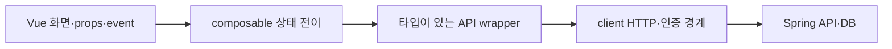
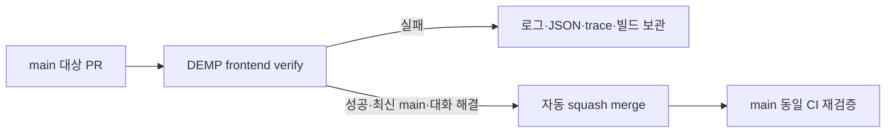

# Vue·TypeScript 검증과 보호된 PR 전달

## 책임과 실행 경로



Vue 컴포넌트는 props/event와 렌더링 책임으로 검토한다. TS 모듈은 공개 계약·변경 이유·의존성 방향으로 검토하며, Vue 컴포넌트에 클래스 SOLID 점수를 매기지 않는다. `useContentReaction`은 저장 중 차단·확정값·늦은 응답 폐기를 소유한다. API가 실패하면 화면이 이전 확정값을 유지해야 한다.

`source-boundaries.mjs`는 Vue의 일반 script/script setup/script src와 TS/JS AST를 읽는다. named/namespace/별칭 import, re-export, 문자열 경로 dynamic import/require를 검사한다. 반응 API의 실행 import는 정확히 `src/composables/useContentReaction.ts`에서만 허용한다. 타입 전용 import는 실행 경로가 아니므로 허용한다. 컴포넌트·뷰는 axios/API client를 직접 가져오지 않으며, composable은 화면을, API는 화면/composable을 역참조하지 않는다. 일반 API wrapper 이용과 기존 client의 store/router 인증 협력은 유지한다.

주석·문자열을 import로 오인하지 않는다. 계산한 import 경로, reflection, 다른 wrapper를 통한 우회, 모든 상태 소유권을 증명하지 않으므로 코드 리뷰와 실제 상태·화면 테스트도 필요하다.

## 하나의 검증 명령

```sh
asdf exec npm ci
asdf exec npx playwright install chromium
asdf exec npm run verify -- --headed
# CI는 npm run verify
```

`verify.mjs`는 경계(probe 포함) → vue-tsc → 전체 Vitest → lint(수정 금지) → build → build의 새 preview 서버 → 결과 계약을 순서대로 실행한다. 실패하면 중단하고 `.verification/summary.json`에 실패 단계와 종료 코드를 남긴다. 각 단계의 로그와 unit/e2e JSON도 같은 폴더에 저장한다. 실행 전에 해당 보고서 폴더를 비워 이전 결과를 재사용하지 않는다.

Playwright가 자신이 시작한 새 production preview만 사용한다. verifier는 빈 loopback 포트를 고르고 `DEMP_E2E_PORT`를 넘긴다. 직접 실행할 때는 숫자 1~65535의 `DEMP_E2E_PORT`를 지정할 수 있다. 포트 충돌은 기존 서버를 쓰거나 다른 포트로 조용히 이동하지 않고 실패한다. fixture route와 원문 이동 assertion은 동일 baseURL에 연결하며 원래 UI 검증을 유지한다. 자동 재시도는 0이다.

`required-verification.json`은 기존 필수 단위 파일, 반응 상태 핵심 assertion, 브라우저 흐름의 이름을 기록한다. 삭제/skip/빈 실행/실패/flaky/집계 불일치는 실패다. 새 테스트는 추가할 수 있으며 총개수 자체를 고정하지 않는다. 계약 이름 변경·삭제는 manifest와 이유를 함께 리뷰한다. 보고서 내용을 검사하며 테스트의 의미나 요구사항 완전성을 자동으로 판단하지 않는다.

`verify-results.mjs`는 dist HTML의 JS/CSS 참조·존재, 개발 진입점·경로 이탈, 알려진 `fixture-token` 혼입을 확인하고 파일 digest를 기록한다. 범용 비밀 탐지기는 아니다. 실행 전후 source/build digest가 다르면 성공을 거절한다. preview는 검증용이고 운영 웹 서버가 아니다.

## 브라우저 검증 범위

기존 Playwright는 API fixture를 사용하는 production 화면·입력·이동·권한 오류·재조회 계약이다. 실제 Spring DB 영속성과 구분한다. 실제 저장 검증은 별도 backend worktree/버전, 격리 H2, preview의 `DEV_API_TARGET`, 브라우저 origin과 Spring CORS 설정을 확인한 뒤 로그인 → 질문/답변 반응 → 전환/취소 → 새로고침 → 별도 HTTP 조회를 수행한다.

로컬에서는 사용자가 지정한 현재 세션에서 headed 러너와 실제 브라우저 과정을 보여준다. 현재 Codex 세션을 지정했다면 cmux를 요구하지 않는다. 자신이 만든 서버만 종료하며 사용자 서버·미커밋 변경은 보존한다.

## CI와 PR



Actions는 검증한 전체 commit SHA로 고정한다. CI는 `contents: read`, checkout credential 미보관, 15분 제한, 동일 PR/branch의 이전 실행 취소를 사용한다. PR와 main push에 경로 필터를 두지 않는다. 증거는 성공/실패 모두 7일 보관한다. 의존성 설치 전 실패하면 일부 보고서가 없을 수 있으므로 GitHub job 로그도 확인한다.

사용자가 PR·머지를 요청한 작업은 전체 검증과 책임 리뷰 후 기존 서명 설정으로 commit/push하고, 같은 head의 열린 PR을 재사용하거나 main PR을 만든다. 사용자 작업과 분리한 파일만 commit하고 PR을 Codex 작업에 첨부한다. 새 무인 봇·예약 작업은 만들지 않는다.

main 보호: PR 필수, GitHub Actions(app 15368)의 정확한 `DEMP frontend verify` 필수, 최신 main 필수, 관리자도 적용, 강제 push·삭제 금지, 대화 해결 필수. 개인 저장소의 승인 인원은 0명이며 승인 리뷰와 자동 검사는 별개다. 저장소의 native auto-merge와 squash를 활성화하고 `gh pr merge <번호> --auto --squash --match-head-commit <전체 SHA>`로 해당 PR에 적용한다. `--admin`이나 main 직접 push로 보호를 우회하지 않는다. 머지 상태·merge SHA·그 main CI를 실제 확인한 뒤 완료한다. 설정은 저장소 외부 상태이므로 다음 전달 때 다시 조회한다.

## 공식 조사 근거

- [Vue TypeScript](https://vuejs.org/guide/typescript/overview): Vite 변환은 타입 검사가 아니며 SFC 검사는 vue-tsc로 수행한다.
- [Vue 테스트](https://vuejs.org/guide/scaling-up/testing.html): 함수/composable, 컴포넌트, 사용자 화면 검증의 목적이 다르며 E2E는 production build를 대상으로 한다.
- [Vue SFC compiler](https://github.com/vuejs/core/tree/main/packages/compiler-sfc) · [TypeScript compiler API](https://github.com/microsoft/TypeScript/wiki/Using-the-Compiler-API): 파일의 실제 구문으로 의존성을 읽는다.
- [Vitest reporters](https://vitest.dev/guide/reporters): 사람이 읽는 출력과 JSON 보고서를 함께 생성한다.
- [Playwright webServer](https://playwright.dev/docs/test-webserver) · [Vite preview](https://vite.dev/config/preview-options.html): readiness와 baseURL을 설정하고 새 build 서버를 소유한다. preview proxy 기본값은 server.proxy이다.
- [Actions 보안](https://docs.github.com/en/actions/reference/security/secure-use): 불변 commit SHA와 최소 권한을 사용한다.
- [보호 브랜치](https://docs.github.com/en/repositories/configuring-branches-and-merges-in-your-repository/managing-protected-branches/about-protected-branches) · [native auto-merge](https://docs.github.com/en/repositories/configuring-branches-and-merges-in-your-repository/configuring-pull-request-merges/managing-auto-merge-for-pull-requests-in-your-repository): 필수 검증과 보호 조건을 통과해야 자동 머지가 완료된다.
