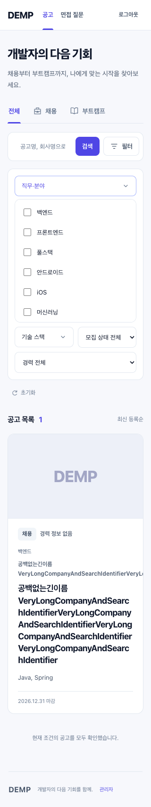
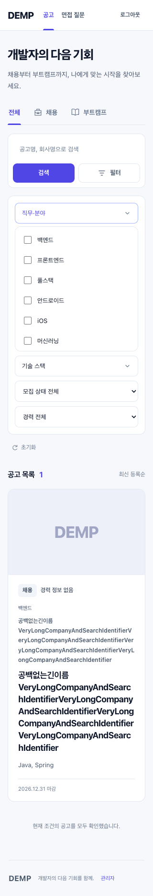
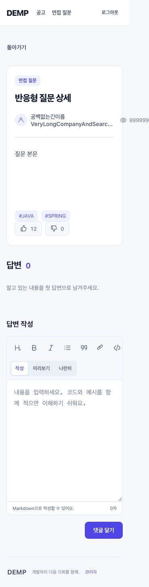
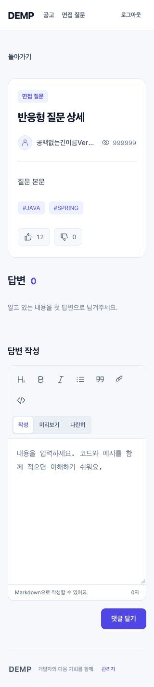
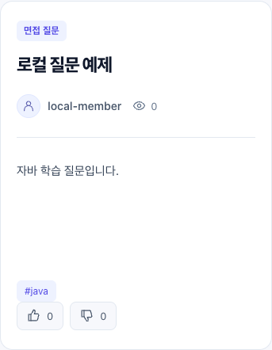
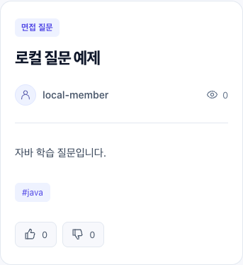

# 화면 비율별 간격 개선

검증일: 2026-10-05 (Asia/Seoul). 아래의 미커밋 설명은 각 로컬 조사·반영 단계의 당시 상태다. 이후 사용자가 UI 변경의 PR·자동 머지를 요청하여 같은 작업 브랜치에서 보호된 전달을 진행했다. 최종 PR·머지·main CI 결과는 Codex 작업에 첨부한 PR에서 확인한다.

최초 구현은 아래 worktree에서 진행했다. 사용자 첨부 화면에 대한 후속 조사에서 기본 실행 폴더에 수정본이 반영되지 않은 사실을 확인하여 `/Users/seungmin/Desktop/repo/archive/dempfrontend`에도 동일한 변경·회귀 테스트·기록을 미커밋 상태로 반영했다. 브랜치 머지나 commit은 실행하지 않았다.

- 작업: 화면 폭에 따라 붙는 버튼·텍스트, 잘리는 입력, 과도한/누락된 여백 조사 및 개선
- 브랜치: `refactor/responsive-spacing-and-controls`
- worktree: `/Users/seungmin/Desktop/repo/archive/dempfrontend/.worktrees/responsive-spacing-and-controls/frontend`
- 기준 코드: `9ef47e4`
- 범위: 공고 검색·필터·상세, 질문 목록·상세·작성, 인증, 관리자 목록·등록
- 검증 폭: 320, 390, 640, 768, 1024, 1440 CSS px

cmux가 실행되지 않은 상태에서 시작했으며 실행 후 외부 프로세스 접근이 거절됐다. 사용자 후속 요청 “여기서 하셈”에 따라 Codex의 표시 브라우저와 headed Playwright에서 검증했다. 접근 설정은 변경하지 않았다.

## 요구사항과 책임

CSS는 배치·간격·텍스트 줄바꿈을, Vue 컴포넌트는 입력과 이벤트를, 기존 상태/API 모듈은 데이터 흐름을 맡는다. 실제 DOM 박스와 문서 폭으로 가로 넘침, 읽을 수 있는 입력 폭, 버튼 간격을 검사한다.

```text
화면 폭 → 공통 CSS → 각 화면의 배치·간격·텍스트 폭
                 └→ 편집기 내부 CSS → 서식 버튼 줄바꿈
입력·클릭 → 기존 Vue 상태/라우트 → 기존 API
```

## Red: 수정 전 실행한 실패

| 실행 | 결과/실패 원인 | 근거 |
|---|---|---|
| 기준 `npm test` | 40개 파일/156개 테스트 통과, exit 0 | `/tmp/demp-spacing-baseline-visible.log` |
| `npm run test:e2e -- tests/e2e/responsive-layout.spec.js --headed --workers=1 --reporter=list,html` | 48개 중 15개 실패, exit 1. 좁은 검색란·필터, 0px 간격, 편집기 도구 잘림 | `/tmp/demp-spacing-red.log`, `/tmp/demp-spacing-red-report/index.html` |
| 같은 명령, 긴 영문 식별값 추가 | 19개 실패/29개 통과, exit 1. 긴 조건 칩·상세 텍스트·회원명의 가로 넘침 | `/tmp/demp-spacing-red-long-text.log`, `/tmp/demp-spacing-red-long-text-report/index.html` |
| `--grep`로 짧은 질문·접힌 오류 검사 | 12개 모두 assertion 실패, exit 1. 본문 높이 180px, 접힌 제보 높이 118px, 제보 앞 간격 0px | `/tmp/demp-spacing-red-content.log`, `/tmp/demp-spacing-red-content-report/index.html` |
| `--grep '공고 상세의 안내' --headed --workers=1` | 6개 모두 assertion 실패, exit 1. 사이드바 내부 기관명/공고 제목 가로 넘침 | `/tmp/demp-spacing-red-sidebar.log`, `/tmp/demp-spacing-red-sidebar-report/index.html` |

첫 테스트 설정에서 광범위한 `**/api/**`가 Vite의 `/src/api/*.ts`까지 가로챘다. 실제 API 주소로 범위를 고친 후 위 Red를 확인했다. 이 설정 오류와 sandbox 안의 로컬 서버 테스트 시간초과는 기능 Red로 세지 않았다. 로컬 서버 테스트는 허용된 실행 환경에서 같은 156개가 통과했다.

## Green: 최소 변경과 원인

| 문제 | 소유자/수정 | 왜 동작하는가 |
|---|---|---|
| 공고 검색란이 버튼에 눌림 | 480px 이하 검색 폼을 2열 Grid로 만들고 입력을 두 열에 걸침 | 입력은 첫 줄 전체 폭, 검색/필터는 다음 줄에 8px 간격 |
| 모바일 필터 선택 값이 좁음 | 480px 이하 필터를 한 열로 배치 | 선택 값과 화살표가 사용할 폭 확보 |
| 질문 검색란이 좁음 | 480px 이하 기준/검색어를 첫 줄, 검색 버튼을 둘째 줄로 배치 | 기준 선택 78px와 8px gap을 뺀 나머지를 입력에 제공 |
| 태그와 반응 버튼이 붙음 | `.question-detail > .reaction-control`에 28px 위 간격 | 실제 직계 자식은 상태 관리 래퍼. 기존 `.content-reactions` 직계 선택자는 적용되지 않음 |
| 작성자/조회수, 긴 회원명 넘침 | 메타를 `minmax(0,1fr) auto`로 배치하고 회원명에 한 줄 말줄임·최대 폭 적용 | 수치 열을 유지하고 이름만 남은 폭 안에서 축소. 한 줄 표시 변경 후 1024px 헤더 회귀가 발견되어 헤더 회원명 최대 180px로 수정 |
| 긴 영문 조건·기관명·상세 넘침 | 조건 칩 최대 폭, 해제 버튼 축소 방지, 카드/상세/사이드바 경계의 `overflow-wrap:anywhere` | 공백 없이도 내용 영역에서 줄바꿈. 사이드바는 제목과 기관명을 함께 담는 영역이 책임을 가짐 |
| 지원 안내와 버튼이 붙음 | apply-bar에 16px gap·줄바꿈, 안내 텍스트 가변 폭 | 가로/세로 배치 모두 간격 유지 |
| 코드 블록 버튼 잘림 | editor-tools 내부 줄바꿈·최소 폭 0 | 바깥 모음뿐 아니라 내부 서식 버튼 묶음도 다음 줄로 이동 |
| 짧은 본문에 큰 빈 공간 | 180px 최소 높이 제거 | 내용 + 기존 상하 padding으로 높이 결정 |
| 접힌 제보에 큰 빈 공간, 지원 안내와 접촉 | 제보 전용 클래스, 20px padding, 24px 위 간격, 펼친 폼 앞 20px 간격 | 전체 로딩/오류 패널의 48px padding을 제보에 그대로 적용하지 않음 |

## 이름·책임·Refactor 검토

Vue의 클릭/입력, props/event, 상태 관리, API 호출 책임은 유지했다. 수정은 공통 배치 CSS, 편집기 내부 배치 CSS, 제보 컴포넌트의 표현 클래스에 한정했다.

`announcement-report`는 제보의 간격/높이 책임을 명시한다. `reaction-control`은 실제 상태 래퍼의 클래스 계약을 따른다. 사용되지 않는 직계 선택자를 계속 덮어쓰지 않고 원래 규칙을 고쳤다. 기존 `anncoucement-*` 클래스는 저장소의 스타일 계약이므로 이번 작업에서 일괄 개명하지 않았다. JSON, DB 컬럼, 라우트와 API 계약 변경은 없다.

추가 객체 추출이나 저장소 전체 리팩터링은 필요하지 않았다. Vue는 렌더링/상태/API 경계로 검토했으며 변경된 독립 TypeScript 클래스·모듈이 없어 SOLID 판정 대상은 없다. 모든 수정 후 같은 테스트를 실행했고 CSS 문자열 일치 검사를 시각 검증으로 대신하지 않았다.

CSS 참고: [자동 최소 폭](https://developer.mozilla.org/en-US/docs/Web/CSS/Reference/Properties/min-width), [gap](https://developer.mozilla.org/en-US/docs/Web/CSS/Reference/Properties/gap).

## 최종 자동 검증

| 명령 | 실제 결과 |
|---|---|
| `asdf exec npm test` | 40개 파일/156개 테스트 통과, exit 0. `/tmp/demp-spacing-final-unit.log` |
| `asdf exec npm run test:e2e -- --headed --workers=1 --reporter=list,html` | 80개 통과(새 화면 회귀 60개 + 기존 사용자 흐름 20개), exit 0. `/tmp/demp-spacing-final-e2e.log` |
| `asdf exec npm run typecheck` | exit 0 |
| `asdf exec npm run lint -- --no-fix` | exit 0 |
| `asdf exec npm run build` | exit 0. `/tmp/demp-spacing-final-build.log` |
| `asdf exec npm run check:agent-contracts` | PASS, exit 0 |
| `git diff --check` | exit 0 |

최종 HTML 보고서는 worktree의 `playwright-report/index.html`, 각 화면/추적 파일은 `test-results/`에 있다. 새 테스트는 실제 DOM에서 크기·공간·내부 넘침을 검사하고 API만 fixture로 제어한다. Spring 저장을 입증하는 테스트로 부르지 않는다.

## Codex의 실제 Spring/H2 화면 확인

사용자 요청에 따라 Codex 표시 브라우저에서 실제 클릭·입력·이동을 실행했다. Vue 서버는 이 프런트 worktree(5050), Spring은 백엔드 현재 코드 `bootRun`(8080), DB는 운영 데이터와 분리된 `jdbc:h2:mem:responsive_spacing`이다. 브라우저의 실제 로컬 주소 `http://127.0.0.1:5050`을 허용 주소로 명시했다.

최초 로그인 시 주소 설정 불일치로 403 `Invalid CORS request`를 확인했고, 검증 서버의 환경 설정을 정확한 주소로 다시 시작했다. 애플리케이션 보안 코드는 변경하지 않았다.

`local-member` 로그인 → 면접 질문 → “로컬” 검색 → 로컬 질문 상세, 공고 목록 → 로컬 공고 상세 → 제보 펼침, 모바일 필터 열기를 실제 UI로 수행했다.

| 관찰 값(320px) | 수정 전 | 수정 후 |
|---|---:|---:|
| 공고 검색란 폭 | 123px | 266px |
| 질문 검색란 폭 | 145.77px | 202px |
| 태그 → 반응 간격 | 0px | 28px |
| 짧은 질문 본문 높이 | 180px | 83.75px |
| 접힌 제보 높이 | 118px | 60px |
| 지원 영역 → 제보 간격 | 0px | 24px |

320px 실제 화면의 문서 폭은 320px로 가로 넘침이 없었다. 가로 방향 844×390에서도 문서 폭 829px(세로 스크롤바 제외)이 화면 폭을 넘지 않았다. 6개 표준 폭의 자동 검증과 이 실제 사용자 흐름의 범위는 다르다. cmux 검증으로 보고하지 않는다. 저장·추천 영속성은 이번 CSS 수정의 검증 범위가 아니다.

## 전후 화면 (Playwright fixture)

| 공고 검색·필터 수정 전 | 수정 후 |
|---|---|
|  |  |

| 질문 상세 수정 전 | 수정 후 |
|---|---|
|  |  |

검색 영역의 결과 표시용 캡처를 추가한 후 320px 공고 검색 시나리오를 별도 output 디렉터리에서 재실행했다. 1개 통과, exit 0 (`/tmp/demp-spacing-preview.log`). 최종 80개 보고서는 그대로 보존했다.

## 사용자 첨부 `#java` 화면의 적용 누락 재검증

기본 폴더의 서버는 5052, 최초 worktree 서버는 5050에서 실행 중이었다. `lsof`로 각 서버의 실제 작업 폴더를 확인했다. 기본 폴더의 `/questions/-1`에서 첨부와 같은 `#java`, 추천 0, 비추천 0을 재현했으며 DOM 간격과 계산된 `margin-top` 모두 0px였다. 첨부 자체에는 주소 정보가 없어 사용자의 원래 페이지 주소와 동일하다고 단정하지 않는다.

원인은 이미 고친 코드가 기본 실행 폴더에 반영되지 않은 것이었다. 기본 폴더에는 여전히 `.question-detail > .content-reactions`가 있었고, 실제 직계 자식은 `.reaction-control`이었다. 이전 worktree의 검증 성공을 기본 실행 화면의 적용 완료로 판단해서는 안 된다.

```text
수정본(worktree) → 기본 실행 폴더에 미커밋 반영 → Vite 화면 갱신
질문 카드 → 태그 → 28px 간격 → reaction-control → 추천·비추천
```

실제 로컬 서버용 임시 검사 `/private/tmp/demp-tag-gap-recheck/tag-gap.spec.mjs`는 UI 로그인 후 질문 상세의 태그와 반응 영역 사이 최소 20px 간격 및 문서 가로 넘침을 검사한다. API mock이나 상태 직접 주입 없이 320·390·640·768·1024·1440px에서 실행했다. 기존 영구 회귀 검사는 `tests/e2e/responsive-layout.spec.js`의 태그 간격 시나리오다.

| 단계 | 명령·결과 |
|---|---|
| Red | `asdf exec npx playwright test -c /private/tmp/demp-tag-gap-recheck/playwright.config.mjs --headed --reporter=list --output=/private/tmp/demp-tag-gap-red-results` → 6개 모두 의도한 간격 assertion 실패(실제 0px), exit 1. `/private/tmp/demp-tag-gap-red.log` |
| Green | 같은 검사, output을 `demp-tag-gap-green-results`로 변경 → 6개 통과, exit 0. `/private/tmp/demp-tag-gap-green.log` |
| 실제 화면 | Codex에서 기본 서버의 동일 질문을 새로고침 → 태그 아래 간격 28px, 계산된 위 여백 28px |

기본 폴더가 깨끗한 상태이고 patch가 충돌 없이 적용되는지 먼저 확인했다. 이전에 검증한 CSS·편집기·제보 표현 변경과 회귀 테스트를 그대로 반영했으며 새로운 상태/API 변경은 없다. 간격 소유자는 질문 카드와 반응 영역의 배치 CSS다. 추가 객체나 임의의 `<span>`은 필요하지 않다.

| 실제 서버 390px: 반영 전 | 반영 후 |
|---|---|
|  |  |

cmux 호출 정보와 live socket이 없어 사용자의 앞선 “여기서 하셈” 요청에 따라 Codex 표시 브라우저와 headed 러너에서 재검증했다. 기본 5052 서버는 유지했고, 에이전트가 이전에 시작한 worktree 5050 서버만 종료하여 기본 폴더의 5050 검증 서버로 다시 시작했다. 전체 E2E를 해석하기 전에 새 PID의 작업 폴더가 기본 폴더임을 확인했다.

기본 실행 폴더에서 최종 검증도 모두 재실행했다.

| 명령 | 결과·근거 |
|---|---|
| `asdf exec npm test` | 40개 파일/156개 통과, exit 0. `/private/tmp/demp-spacing-current-unit.log` |
| `asdf exec npm run test:e2e -- --headed --workers=1 --reporter=list,html` | 80개 통과, exit 0. `/private/tmp/demp-spacing-current-e2e.log`, 기본 폴더 `playwright-report/index.html` |
| `asdf exec npm run typecheck` | exit 0. `/private/tmp/demp-spacing-current-typecheck.log` |
| `asdf exec npm run lint -- --no-fix` | exit 0. `/private/tmp/demp-spacing-current-lint.log` |
| `asdf exec npm run build` | exit 0. `/private/tmp/demp-spacing-current-build.log` |
| `asdf exec npm run check:agent-contracts`, `git diff --check` | 모두 exit 0 |

첫 단위 테스트 실행은 sandbox의 로컬 서버 바인딩 제한(`listen EPERM`)으로 2개가 실패했다. 이를 간격 회귀나 통과로 처리하지 않고, 서버를 실행할 수 있는 환경에서 같은 전체 명령을 재실행해 156개 통과를 확인했다. 코드와 assertion은 변경하지 않았다.

## 완료된 프런트 CI 작업의 로컬 반영

2026-10-05 04:26 KST 기준. 사용자 요청에 따라 `CI·자동 PR·머지 설정` 채팅(01a1080f-7daf-7670-b740-8c3e03a0efa0)의 완료 결과를 반영했다. [PR #1](https://github.com/seungmin-park/dempfrontend/pull/1)의 `MERGED` 상태와 merge commit `7237b7ffd118242e0dfbfa4f55f7690b5907fb3a`, [해당 main CI](https://github.com/seungmin-park/dempfrontend/actions/runs/37227755691)의 `success`를 읽기 전용으로 직접 확인했다.

```text
완료된 CI 커밋 ── fast-forward ──► 기본 실행 폴더
기존 미커밋 UI 수정 ── 보존 ─────► 같은 폴더
                                ↓
                       전체 검증 → production 빌드
                                ↓
                     5052 실제 Spring 연결 화면
```

로컬 main을 `9ef47e4`에서 `7237b7f`로 fast-forward했다. 다른 저장소/서버의 상태는 갱신하지 않았다. 겹친 파일은 기능 지도뿐이므로 해당 변경을 별도 patch로 보존하고, 최신 CI 안내와 기존 반응형 검증 안내를 함께 남겼다. 기존 CSS·제보·편집기 3개 소스는 작업 전 백업의 SHA-256과 바이트 단위로 일치한다. 새 commit·push·PR·외부 머지는 실행하지 않았다.

### 검증 방식의 통합 실패와 수정

- 새 E2E는 기존 서버를 재사용하지 않고 별도 포트의 production preview를 실행한다. 기존 반응형 fixture가 5050 주소에 고정되어 5053의 질문 제목 assertion에서 시간초과했다. `/api/**`를 baseURL 기준으로 사용하도록 바꾸었다. 이 실패는 간격 결함의 Red가 아니라 실행 주소 통합 문제다. 로그: `/private/tmp/demp-ci-spacing-port-red.log`.
- 첫 전체 실행은 단위 195개·E2E 80개가 통과했지만, 보고서 검증에서 화면 폭별 같은 짧은 테스트 제목이 중복으로 거절되어 전체 exit 1이었다. 각 테스트 제목에 해당 화면 폭을 명시해 식별 계약을 맞췄다. 최소 간격·넘침·높이 assertion과 검사기는 변경하지 않았다. 첫 결과: `/private/tmp/demp-ci-spacing-report-red/summary.json`, 로그: `/private/tmp/demp-ci-spacing-integrated-verify.log`.
- `layoutFixture`는 API만 제어하고, 기존 상태 소유권과 props/event·라우트·직렬화 계약은 유지한다. 테스트 이름의 폭은 각각의 관찰 가능한 화면 조건을 드러낸다. 별도의 상태/API 객체나 검사 체계는 추가하지 않았다.

### 최종 통합 검증

| 검증 | 실제 결과 |
|---|---|
| `asdf exec npm run verify -- --headed` | 전체 exit 0. 계약/probe·타입·단위·lint·build·production E2E 모두 exit 0 |
| 단위 | 43개 파일, 195개 통과 |
| production 브라우저 | 기존 흐름 20개 + 반응형 회귀 60개 = 80개 통과. skip·실패·재시도 0 |
| 실제 5052 Spring 연결 | UI 로그인 후 6개 폭에서 java 태그 아래 여백과 가로 넘침 검사 6개 통과, exit 0 |
| Codex 현재 화면 | 새로고침 후 java 태그 아래 28px, 문서 폭 879px ≤ viewport 894px |
| 서버/빌드 일치 | 5052 PID 84865의 cwd는 기본 실행 폴더. 응답 HTML이 해당 `dist/index.html`과 바이트 단위 일치 |

전체 로그는 `/private/tmp/demp-ci-spacing-integrated-final.log`, 구조화된 결과는 기본 폴더 `.verification/summary.json`, HTML은 `playwright-report/index.html`이다. 실제 서버 검사 로그는 `/private/tmp/demp-ci-spacing-real-final.log`이다.

검증된 소스 SHA-256: `5fb659ecf70c89c724dcae3b6e8d2e8dd05d1be9b734779a569df79ae849519b`.
빌드 SHA-256: `472b14b3e895edcf43bd427ba69b51b7f2236355677b26c33df1a11ba91d2cdf`.

현재 5052 주소는 완료된 CI 작업 폴더의 preview에서 통합된 기본 폴더의 preview로 전환했다. 사용자의 현재 화면 반영 요청에 따라 종료된 작업의 해당 검증 프로세스만 교체했으며 다른 포트나 Spring 서버는 유지했다. API는 기존 `http://127.0.0.1:18082`의 로컬 Spring/H2에 연결했다. API mock E2E의 통과와 실제 간격 확인을 구분하며 이번 후속 작업에서 서버 저장·전환·취소를 새로 검증했다고 주장하지 않는다.


기존 UI 변경과 검증 방식에 맞춘 테스트 변경은 미커밋 상태로 유지했다. 최초 worktree 및 `/private/tmp/demp-responsive-before-ci-apply`는 원본 보존용으로 남겼다.

## UI 변경의 보호된 PR 전달 검증

사용자의 후속 PR·자동 머지 요청에 따라 기존 `refactor/responsive-spacing-and-controls` worktree를 `7237b7f` 기준으로 갱신하고 현재 화면에 적용된 최종 파일을 반영했다. 공통 CSS·편집기·제보 컴포넌트·회귀 테스트가 기본 실행 폴더와 바이트 단위로 같은지 확인했다.

해당 worktree에서 `asdf exec npm run verify -- --headed`를 새로 실행하여 exit 0, 단위 43개 파일/195개, production E2E 80개 통과를 확인했다. 모든 단계가 exit 0이며 skip·재시도·실패는 없다. 로그는 `/private/tmp/demp-responsive-pr-local-verify.log`, 결과는 worktree `.verification/summary.json`이다. 소스 digest는 `5fb659ecf70c89c724dcae3b6e8d2e8dd05d1be9b734779a569df79ae849519b`, 빌드는 `472b14b3e895edcf43bd427ba69b51b7f2236355677b26c33df1a11ba91d2cdf`로 이전 통합 검증과 같다.

전달 전 GitHub 보호 설정을 재조회했다. `DEMP frontend verify`는 GitHub Actions app 15368의 필수 검사이며 최신 main, 관리자 동일 적용, 대화 해결이 강제된다. 강제 push와 삭제는 금지되고 native 자동 squash 머지가 활성화돼 있다. 필수 사람 승인 수는 0명이다. 기존 필수 테스트·검사기·manifest는 변경하지 않았다. PR 본문과 작업 기록에 CSS/표현 책임 검토와 실제 실행 근거를 남긴다.
